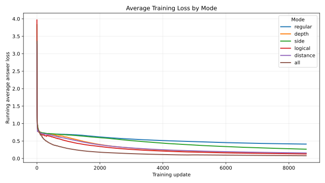
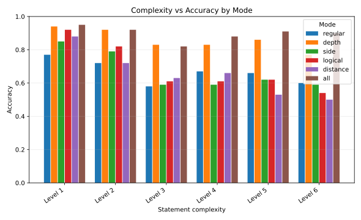

# Parallel Structural Embeddings for Logic Truth Prediction

## Abstract

This project investigates whether adding parallel structural embeddings to a small transformer improves both training efficiency and statement truth-prediction accuracy on generated propositional logic formulas. The model is trained to read a formula and predict a single `true` or `false` token, where `true` means the formula is a tautology and `false` means it is not. The baseline model uses only learned token and positional embeddings. The experimental models add learned structural embeddings for parenthesis depth, implication side, logical token role, implication distance, or all structural features together. The experiment compares how these modes affect answer loss during training and accuracy across increasing statement complexity. The results suggest that some structural embeddings carry more useful information than others, improving accuracy as complexity increases and seemingly lowering the loss floor during training. This supports the idea that explicit symbolic structure can act as a useful inductive bias for transformer-based logical reasoning.

## Introduction

Transformers are strong sequence models, but a raw token sequence does not directly expose the structure of a formal logic statement. A formula such as `( A AND B ) -> A` contains more than a list of symbols. It has nested subexpressions, operators, antecedents, consequents, and parenthetical scope. A regular transformer can learn these relationships from data, but it must infer them indirectly from token identity and token position.

This project tests whether the model learns faster and predicts more accurately when some of that structure is provided directly. The key idea is to add structural embeddings in parallel with the normal token and position embeddings. These embeddings are not hard-coded truth labels and do not solve the formula by themselves. Instead, they provide learned vectors indexed by structural features of each token. The transformer still has to learn how to use those features.

The experiment compares six embedding modes:

- `regular`: token and position embeddings only.
- `depth`: adds parenthesis-depth embeddings.
- `side`: adds implication-side embeddings.
- `logical`: adds logical-role embeddings.
- `distance`: adds implication-distance embeddings.
- `all`: combines every structural embedding.

The main question is whether these additional feature channels improve training rate, reduce answer loss, and increase accuracy as formulas become more complex. A secondary question is whether all structural signals are equally useful, or whether some features carry more information for the task than others.

## Literature Review

The transformer architecture introduced by Vaswani et al. in [Attention Is All You Need](https://arxiv.org/abs/1706.03762) established attention-only sequence modeling as a powerful alternative to recurrent and convolutional architectures. The original transformer depends on token embeddings and positional information to represent sequence order. That design is flexible, but it does not automatically encode domain-specific structure such as parse trees, formula nesting, or logical operator roles.

Later work explored ways to give attention models richer structural or relational information. Shaw, Uszkoreit, and Vaswani proposed [Self-Attention with Relative Position Representations](https://arxiv.org/abs/1803.02155), showing that attention can be extended to use representations of relative positions or distances between sequence elements. That work is relevant here because this project also treats distance as an input feature, especially distance from implication tokens. The difference is that this project uses task-specific symbolic distances as additive embeddings rather than modifying the attention computation itself.

Tree-structured transformer research is also closely related. Wang, Lee, and Chen proposed [Tree Transformer: Integrating Tree Structures into Self-Attention](https://arxiv.org/abs/1909.06639), which adds constraints to encourage attention heads to follow hierarchical tree structures. Their work focuses on natural language hierarchy, but the motivation is similar: ordinary attention does not necessarily align with human-interpretable structure, so adding structural bias can improve learning and interpretability.

More directly, Bartkowiak and Gralinski proposed [Seamlessly Integrating Tree-Based Positional Embeddings into Transformer Models for Source Code Representation](https://arxiv.org/abs/2507.04003). Their work encodes hierarchical AST relationships, including depth and sibling information, into transformer representations for source code. This is one of the closest examples to this project. It shows that tree-like positional information can improve transformer performance in a structured symbolic domain. The present project applies a similar principle to propositional logic formulas rather than source code.

There is also related work on transformers learning logical semantics. Hahn, Schmitt, Kreber, Rabe, and Finkbeiner showed in [Transformers Generalize to the Semantics of Logics](https://finkbeiner.groups.cispa.de/publications/HSKRF20.html) that transformers can learn semantic behavior for propositional logic and linear temporal logic from generated data. Their work focused on producing satisfying assignments or traces rather than only predicting a truth label, but it demonstrates that transformers can learn nontrivial logical behavior. Their paper also reports that tree positional encodings improved generalization to longer formulas, which aligns strongly with this project's motivation.

Another relevant paper is Hong et al.'s [A Implies B: Circuit Analysis in LLMs for Propositional Logical Reasoning](https://arxiv.org/abs/2411.04105). That work studies how language models solve propositional reasoning problems internally and uses mechanistic tools to identify sparse reasoning circuits. It does not add the same embedding features used here, but it supports the broader claim that propositional logic tasks are useful testbeds for analyzing transformer reasoning.

Based on this search, something like this project has been done in a broader sense: researchers have studied structural transformer encodings, tree positional embeddings, and transformer reasoning on logic tasks. However, an exact match for this project and setup wasn't found. The setup: comparing additive parenthesis-depth, implication-side, logical-role, and implication-distance embeddings on a generated true/false tautology prediction task while measuring both training loss and accuracy by complexity. This project therefore sits at the intersection of existing ideas, but tests a narrower and more specific feature set.

## Methodology And Results

The dataset is generated as a large text file of propositional logic statements. Each line contains a formula, its truth label, and its complexity level:

```text
formula<TAB>true|false<TAB>complexity
```

The generation process creates a balanced dataset in which half of the statements are true and half are false. This balance is important because a model should not be able to achieve high accuracy simply by learning a label-frequency shortcut. The generated formulas vary across multiple complexity levels. Lower-complexity statements tend to be shorter and shallower, while higher-complexity statements contain deeper nesting and more involved combinations of variables and operators.

The truth labels are verified symbolically before training and evaluation. The project uses a BFS-style brute-force verification process over the possible truth assignments for the variables in each formula. For each assignment, the formula is evaluated according to the semantics of `AND`, `OR`, and implication. A formula is placed in the `true` category only if it evaluates to true for every assignment, making it a tautology. Otherwise, it is placed in the `false` category. This verification is applied to both training and test data so that the model is not learning from mislabeled examples.

The model is a small decoder-only transformer. During training, the formula text is the prompt and the target output is a single answer token: `true` or `false`. The training loss is only applied at the answer-token position. This setup matters because the model is not being trained to copy or reconstruct the input formula. It is being trained specifically to predict the statement's truth category after reading the formula.

The baseline input representation is:

```text
token embedding + position embedding
```

The experimental modes add structural embeddings to that base representation:

```text
token embedding
+ position embedding
+ selected structural embedding(s)
```

The structural embeddings are additive, not concatenated. This means every mode keeps the same transformer width. The downstream transformer blocks, attention heads, MLPs, normalization, and unembedding layer remain the same. That makes the experiment cleaner because the main difference between modes is the information added at the input.

The parenthesis-depth embedding tells the model how deeply nested each token is inside parentheses. This can help the model distinguish local subexpressions from outer formulas. The implication-side embedding marks whether a token occurs before an implication, at the implication, or after it. This can help separate antecedent and consequent regions. The logical-role embedding marks whether a token is a variable, operator, parenthesis, implication token, padding token, or another parameter-like token. This can help the model distinguish syntax from content. The implication-distance embedding records how far each token is from the nearest `->` token, giving the model a structural distance signal around implication boundaries.

The `all` mode combines all of these structural signals. This tests whether the features are complementary or whether adding all of them creates unnecessary noise. A useful outcome would be either a strong combined mode or a clear single-feature winner, because both results would say something about which symbolic structures matter most for this task.

The first result graph compares running average answer loss during training:



The loss plot suggests that the embedding modes do not behave identically during training. Some modes appear to reach lower answer loss than others, and the structural embeddings seem to lower the apparent loss floor for the model. This is important because a lower loss floor suggests that the model can fit the task more cleanly when it receives useful structural information. It also suggests a possible improvement in training efficiency: if the model reaches a better loss level sooner, then the added embeddings are not only improving final performance but also helping the model learn the task faster.

The second result graph compares prediction accuracy across statement complexity levels:



The accuracy plot suggests that structural embeddings can help as formula complexity increases. The regular baseline must infer every structural relation from the token sequence alone. The structural modes, in contrast, receive extra information about nesting, implication boundaries, token roles, or distances to important operators. As complexity rises, that extra information appears to help some models maintain better accuracy.

The results also show that not all embeddings carry the same amount of useful information. Some structural channels seem more helpful than others. This makes sense because not every structural feature is equally connected to truth prediction. Parenthesis depth may help with nested scope. Implication side may help because implication is central to many tautological patterns. Logical role may help separate operators from variables. Distance to implication may help the model organize attention around one of the most semantically important operators. The experiment suggests that the usefulness of a structural embedding depends on whether it matches a feature the model actually needs for the reasoning task.

Overall, the results support the hypothesis that parallel structural embeddings can improve both learning rate and statement truth-prediction accuracy. The improvement is most interesting at higher complexity levels, where the model has more structure to keep track of and more opportunities to benefit from explicit symbolic cues.

## Additional Work

A natural next step is to use sparse autoencoders to inspect the model's internal features. Sparse autoencoders are useful because they can decompose model activations into more interpretable, sparsely active directions. Cunningham et al. showed in [Sparse Autoencoders Find Highly Interpretable Features in Language Models](https://arxiv.org/abs/2309.08600) that sparse autoencoders can identify more monosemantic features in language model activations. Gao et al. extended this direction in [Scaling and evaluating sparse autoencoders](https://arxiv.org/abs/2406.04093), studying how sparse autoencoders scale and how to evaluate feature quality.

For this project, sparse autoencoders could be trained on the residual stream, MLP activations, or attention outputs of the custom logic model. The goal would be to discover which internal features the model learns while solving truth prediction. Some discovered features might correspond to the hand-designed embeddings already tested, such as depth, implication side, or operator role. More interestingly, the sparse autoencoder might reveal additional useful features that were not manually designed.

Possible discovered features could include:

- whether a subformula has the shape `A -> A`
- whether a conjunction appears on the left side of an implication
- whether an expression matches a known tautological template
- whether two variables appear in mirrored positions
- whether a subexpression is likely irrelevant to the final truth value
- whether a token belongs to a repeated or reused variable pattern

If these features are consistently found inside the trained model, they could be turned into new explicit embeddings. The project could then run another round of experiments to test whether adding those discovered features improves training efficiency and statement accuracy beyond the current structural embeddings.

This would create a feedback loop. First, train the model with simple human-designed structural embeddings. Second, use sparse autoencoders to inspect what features the model discovers internally. Third, convert useful discovered features into new embeddings. Fourth, retrain and evaluate whether those embeddings improve loss and accuracy. This would make the project more than a comparison of hand-designed embeddings; it would become a method for iteratively discovering and testing better symbolic features.

## Conclusion

This project tested whether a transformer can learn propositional truth prediction more effectively when given explicit structural information about the input formula. The results suggest that structural embeddings can help. Some embeddings appear to improve accuracy on more complex statements and lower the model's training loss floor, allowing the model to become more accurate during training and possibly reach useful performance faster.

The broader literature shows that related ideas have already been explored: transformers can learn logical semantics, tree-based encodings can improve structured-domain modeling, and mechanistic analysis can reveal reasoning circuits in models solving propositional tasks. However, this project's exact comparison of additive logical structural embeddings for tautology prediction is a more specific experiment within that broader research direction.

The main conclusion is that structure matters. A transformer can learn from flat token sequences, but formal logic contains information that is naturally hierarchical and relational. Giving the model direct access to some of that structure can improve the way it learns. Future work with sparse autoencoders could help identify additional internal reasoning features and turn them into new embeddings, potentially improving both training efficiency and truth-prediction accuracy further.

## References

- Vaswani et al., [Attention Is All You Need](https://arxiv.org/abs/1706.03762).
- Shaw, Uszkoreit, and Vaswani, [Self-Attention with Relative Position Representations](https://arxiv.org/abs/1803.02155).
- Wang, Lee, and Chen, [Tree Transformer: Integrating Tree Structures into Self-Attention](https://arxiv.org/abs/1909.06639).
- Bartkowiak and Gralinski, [Seamlessly Integrating Tree-Based Positional Embeddings into Transformer Models for Source Code Representation](https://arxiv.org/abs/2507.04003).
- Hahn et al., [Transformers Generalize to the Semantics of Logics](https://finkbeiner.groups.cispa.de/publications/HSKRF20.html).
- Hong et al., [A Implies B: Circuit Analysis in LLMs for Propositional Logical Reasoning](https://arxiv.org/abs/2411.04105).
- Cunningham et al., [Sparse Autoencoders Find Highly Interpretable Features in Language Models](https://arxiv.org/abs/2309.08600).
- Gao et al., [Scaling and evaluating sparse autoencoders](https://arxiv.org/abs/2406.04093).
